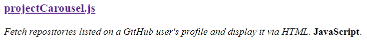

# &#127904; projectCarousel.js

Fetch data and display repositories listed on a GitHub user's profile



## About

I realized how silly it was that I was manually updating the "Projects" section of my website, meanwhile I was always updating according to the progress of the repositories I was working on, which are publically displayed on my GitHub profile.

I wanted to implement a simple script that can be included in my HTML page which will grab my GitHub profile's public repositories and format important information into a `<div>` of my choosing, so that's what I did. I used GitHub's [REST API v3](https://developer.github.com/v3/) to request the repositories on the client side of the HTML page's vistor.

## How it works

```html
<body onload="projectCarousel('projects')">

    <div id="projects"></div>

    <!-- Include projectCarousel.js -->
    <script src="/projectCarousel.js"></script>

</body>
```

1. Use the `onload` event to execute the `projectCarousel()` function immediately after your HTML page's `<body>` loads

2. In the function call, include the `id` of the `<div>` you want to write the pulled repositories to, which in my case is "projects"

3. Include the script where the `projectCarousel()` function lies at the end of your `<body>`, which in my case is `/projectCarousel.js`

```javascript
const profileName = "magarenzo";
const skippedProjects = ["magarenzo.github.io-Blog", "magarenzo.github.io-Old"];
```

1. Update the value of `profileName` to your GitHub username

2. Update the values of `skippedProjects` to any repositories you want to skip, otherwise leave the array empty

```javascript
var url = JSON.stringify(jsonObject[key].html_url).split('"').join("");
var description = JSON.stringify(jsonObject[key].description).split('"').join("");
var language = JSON.stringify(jsonObject[key].language).split('"').join("");

div.innerHTML += "<h3><a target='_blank' href='" + url + "'>" + name + "</a></h3>";
div.innerHTML += "<p><em>" + description + "</em>. <strong>" + language + "</strong>.</p><br>";
```

1. Capture whichever values you want to use by their keys

2. Alter the HTML according to how you want to display the projects

## Created with

* [JavaScript](https://www.javascript.com/)

## Owner

Michael A. Agarenzo
